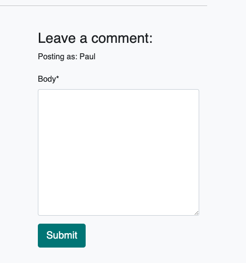

# Autonimo Andalucia

Autonimo Andalucia is a job posting website designed to be used by self-employed (Autónomos) people. It currently has listings in four different categories: Land Management, Swimming Pool Maintenance, Transportation, and Handyman Work. It allows users to register and interact with job postings.

## Post and Comment Relationship Diagram

## User Stories

- As a site user, I can view a paginated list of posts so that I can select which post I want to view.
- As a Site User / Admin, I can view comments on an individual post so that I can read the conversation.
- As a Site User I can register an account so that I can comment on a post.
- As a Site User I can leave comments on a post so that I can interact with the listings
- As a Site User I can modify or delete my comment on a post.
- As a Site Admin I can create, read, update and delete posts so that I can manage the listings.
- As a Site Admin I can create draft posts so that I can finish writing the content later.
- As a Site Admin I can approve or disapprove comments so that I can filter out objectionable comments.

## Features

- Pagination - The posts are paginated so that the user can view 6 posts per page. There is a link to the next page at the bottom of the page. When the user is not on the first page of listings, there is a link to the previous page.
  

- Navbar - The navbar is fixed to the top of the page so that the user can easily navigate the site. The navbar contains links to the home page, about page and the login/logout page and register page.

- login status.

- About Page

- Register Page

- Login Page

- Logout Page

- Listings Page

- Authentication for comments. 

- Comments box

- Comment counter

- Contact admin form

## Technologies Used

- HTML - The project uses HTML to create the structure of the site.
- CSS - The project uses CSS to style the site.
- JavaScript - JavaScript was used to link the buttons to functionality
- Python - The project uses Python to create the backend of the site.
- Django - The project uses Django as the web framework.
- Heroku - The project is deployed on Heroku.
- Git - The project uses Git for version control.
- GitHub - The project uses GitHub to store the code and to plan the project.
- Postgres - The project uses Postgres as the database.
- Bootstrap - The project uses Bootstrap to style the site.
- Google Fonts - The project uses Google Fonts to import the font used in the site.
- ElephantSQL - The project uses ElephantSQL to host the database.
- Draw.io - The project uses Draw.io to create the wireframe.
- Cloudinary - The project uses Cloudinary to host the images.

## Future Features

- The next feature of the site will likely be a seperate "advertise" page which will contain a form for users to submit their own listings. This will be a feature that will only be available to registered users. It will have inputs for every part of the post and the image upload.

## Setting up Django

## Deploying to Heroku

## Setting up the Database

## Testing

|        Component     |       Test       |     Expected Result.      |           Actual Result         |
|----------------------|------------------|---------------------------|---------------------------------|
| Home page display as expected | Click on Home | Home page displayed | Home page with job listings and images visible.  |
| About page link working | Selected About link | About page to display | About page displayed |
| About page displays | Click on About | About page to display as expected | About page displayed paragraph about the site and the table to contact admin |
| Form to register interest | Fill in all form fields | Alert renders on admin about page | Alert appeared on admin and about page |
| Form fields | Skip completing form fields | Alert to please fill in field  | Alert appeared to fill in field |
| Email form field | Fill in email in incorrect format | Alert to include @ in email | Alert appeared to include @ for email |
| Work list display | Click on home | List of blog posts appears as 6 per page | List of work post displayed as 6 per page |
| Next and Prev Buttons | Work as expected | Next brings to next page, prev brings to previous | Next brought to next page, previous brought to previous list of blog posts |
| Full blog post display | On click of blog title in blog list full blog display | Full blog post displays | Full blog post displayed |
| Comment Counter | Scroll to comment section | Shows users a small graphic with number of comments | Displays correctly |
| Log in Prompt | To display when not log in | Message display in like and comment to prompt a log in | Messaged displayed to visitor to log in to interact with post |
| Like Log in Prompt Link Working | Link to sign in page working | User brought to sign in page when clicked | User is brought to log in page when link |
| Comment | Site User can leave a comment | User can leave a comment and receive confirmation | Member placed comment and received notification that comment is awaiting approval |
| Not logged in Comment | If not logged in cannot comment | Message displaying to prompt visitor to log in if they want to leave a comment | Message displayed to visitor to sign in to leave comment |
| Comment Log in Link | Link working | On click of link user brought to sign in page | User clicked log in link and brought to log in page |
| Edit Comment | Can only edit own comment | Only users own comment can be edited | User could only edit their comment and receive an alert to state they did so |
| Delete Comment | Users can delete own comments | Users can delete comment once confirmation received | User could delete a comment they left once confirming they were happy to do so |
| Sign Up Form | Working as expected | New user created as a result | All fields of form completed and new user created |
| Log In Link on Sign Up page | Link working | On click log in link brings to log in page | User brought to log in page once clicked |
| Sign In Field Validation | Field Validation | Alert user if field missed | Field missed on completing form and alert received to fill in missing field |
| Password Validation | Password | Alert raised if criteria not met | Alert raised as a result of not matching password or too similar to user name |
| Log In Form | Allows user to sign in | User can sign in and gain full functionality of blog | User signed in successfuly when correct credentials supplied |
| Sign Up Link on Log In Page | Link working | On click brought to sign up page | User brought to log in page once clicked |
| Sign Out | User can sign out | Sign out successfully and asked to confirm | User could sign out once they confirmed that was their intention|
## Credits
